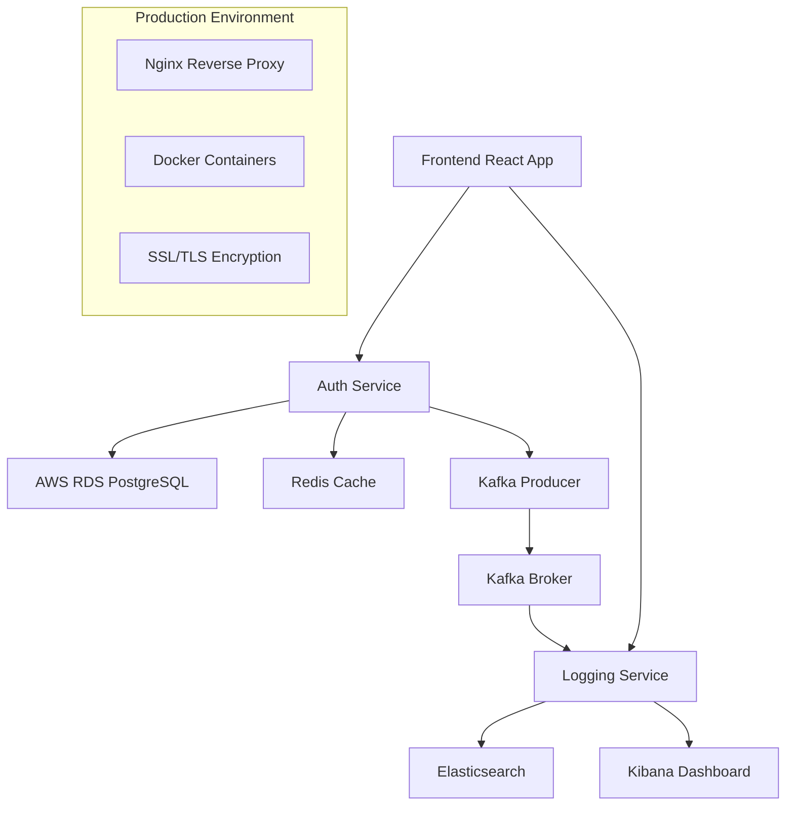

# **Enterprise Logging and Monitoring System (Simplified SIEM)**  

A logging and monitoring system that tracks authentication events, detects suspicious patterns, and provides real-time visualization. The project 
simulates basic security monitoring for authentication activity. 

🌐 **Live Demo**: [siemnss.ddns.net](http://siemnss.ddns.net)

## **Table of Contents**  
- [**Overview**](#overview)
- [**Features**](#features)
- [**Live Demo**](#live-demo)
- [**Installation \& Setup**](#installation--setup)
- [**Usage**](#usage)
- [**API Documentation**](#api-documentation)
- [**Development Guide**](#development-guide)
- [**Project Structure**](#project-structure)
- [**Architecture**](#architecture)
- [**Additional Documentation**](#additional-documentation)
- [**Team Members \& Contact**](#team-members--contact)

---

## **Overview**  
This project is designed to track user authentication events, store logs, 
analyze suspicious patterns, and visualize data in a real-time dashboard. It 
simulates an enterprise-level **Security Information and Event Management 
(SIEM)** system with a focus on login monitoring. 

**Core Architecture:**
- **Microservices**: Independent auth and logging services
- **Event-Driven**: Apache Kafka for real-time event streaming  
- **Cloud Integration**: AWS RDS PostgreSQL database
- **Search Engine**: Elasticsearch with Kibana analytics
- **Production Ready**: Deployed with Docker orchestration

**Key functionalities include:**  
- **Multi-service Authentication** with role-based access control
- **Real-time Log Processing** via Kafka event streaming
- **Advanced Threat Detection** (brute-force, distributed attacks, anomalies)
- **Interactive Dashboard** with live security metrics
- **Comprehensive API** for integration and automation

---

## **Features**  

### **Security & Authentication**
- Token-based authentication with JWT-like security
- Role-based access control (Admin/User roles)
- Password hashing with salt encryption
- Account lockout protection
- Multi-factor security validation

### **Monitoring & Analytics**
- Real-time log collection and processing
- Advanced threat detection algorithms
- Geolocation-based access monitoring
- High-frequency event analysis
- Automated security alert generation

### **User Interface**
- Modern React/TypeScript frontend
- Real-time dashboard with live updates
- Interactive log search and filtering
- Mobile-responsive design

### **Infrastructure**
- Microservices architecture
- Docker containerization
- Apache Kafka event streaming
- Elasticsearch for log storage
- Redis caching for performance
- AWS RDS cloud database

---

## **Live Demo**  
**Production URL**: [siemnss.ddns.net](http://siemnss.ddns.net)

The application is deployed in production and available for testing. You can:
- Register a new account
- Explore the security dashboard
- View real-time log processing
- Test security features and alerts

**Demo Features Available:**
- User registration and authentication
- Real-time security dashboard
- Log search and filtering
- Security alert monitoring
- Administrative panel (with admin account)

---

## **Installation & Setup**  

### **Prerequisites**
- Docker Engine 20.10+
- Docker Compose 2.0+
- Git for cloning the repository
- 8GB+ RAM recommended for all services

### **Quick Start**

1. **Clone the Repository**
   ```bash
   git clone https://github.com/B4SEE/Simplified_SIEM
   cd Simplified_SIEM
   ```

2. **Start All Services**
   ```bash
   docker-compose up -d --build
   ```

3. **Create Admin User**
   ```bash
   docker-compose exec auth_service python create_admin.py
   ```

4. **Access the Application**
   - **Frontend**: http://localhost:3000
   - **Auth Service**: http://localhost:5001
   - **Logging Service**: http://localhost:5000
   - **Elasticsearch**: http://localhost:9200
   - **Kibana**: http://localhost:5601

### **Frontend Development Setup**

1. **Navigate to Frontend Directory**
   ```bash
   cd frontend
   ```

2. **Install Dependencies**
   ```bash
   npm install
   ```

3. **Start Development Server**
   ```bash
   npm start
   ```

4. **Build for Production**
   ```bash
   npm run build
   ```

### **Testing the System**

Run the alarm test script to generate sample security events:
```bash
python alarm_test_script.py
```

---

## **Usage**  

### **User Registration & Authentication**
1. Navigate to the frontend application
2. Register a new account or use existing credentials
3. Login to access the security dashboard

### **API Integration**
The system provides RESTful APIs for integration:
- Authentication endpoints for user management
- Logging endpoints for log ingestion and retrieval
- Alert endpoints for security alarm management

---

## **API Documentation**

### **Authentication Service** (`/api/auth`)
- `POST /login` - User authentication
- `POST /register` - User registration  
- `GET /profile` - Get user profile
- `PUT /profile` - Update user profile
- `PUT /password` - Change password
- `GET /status` - Service health check

### **Logging Service** (`/api`)
- `POST /logs` - Receive log entries
- `GET /logs/search` - Search and filter logs
- `GET /logs/stats` - Get logging statistics
- `POST /process_logs` - Process log entries

### **Alarms Service** (`/api/alarms`)
- `GET /` - Get user alarms
- `POST /` - Create new alarm
- `GET /<id>` - Get specific alarm
- `PUT /<id>` - Update alarm
- `DELETE /<id>` - Delete alarm

**Authentication**: All API endpoints require Bearer token authentication.

---

## **Development Guide**  

### **Technology Stack**
- **Backend**: Python, Flask, SQLAlchemy
- **Frontend**: React, TypeScript, Material-UI
- **Database**: PostgreSQL (AWS RDS in production)
- **Message Queue**: Apache Kafka
- **Search Engine**: Elasticsearch + Kibana
- **Caching**: Redis
- **Containerization**: Docker + Docker Compose
- **Cloud**: AWS RDS

---

## **Project Structure**  
```plaintext
📂 Simplified_SIEM/
├── 📂 auth_service/                    # Authentication microservice
│   ├── 📂 app/
│   │   ├── __init__.py                # Flask app factory
│   │   ├── 📂 models/                 # Database models
│   │   │   ├── user.py               # User model with RBAC
│   │   │   ├── role.py               # Role management
│   │   │   ├── login_log.py          # Authentication logging
│   │   │   └── alarm.py              # Security alarms
│   │   ├── 📂 blueprints/            # API route handlers
│   │   │   ├── auth.py              # Authentication endpoints
│   │   │   ├── logs.py              # Log management
│   │   │   └── alarms.py            # Alarm management
│   │   ├── 📂 tasks/                # Async task processing
│   │   │   └── email_tasks.py       # Email notifications
│   │   ├── celery.py                # Celery configuration
│   │   └── config.py                # Service configuration
│   ├── 📂 alembic/                  # Database migrations
│   ├── create_admin.py              # Admin user creation script
│   ├── run.py                       # Service entry point
│   ├── requirements.txt             # Python dependencies
│   ├── Dockerfile                   # Container configuration
│   └── 📂 tests/                    # Unit and integration tests
├── 📂 logging_service/              # Log processing microservice
│   ├── 📂 app/
│   │   ├── __init__.py             # Flask app factory
│   │   ├── 📂 blueprints/          # API endpoints
│   │   │   ├── api.py             # Log API endpoints
│   │   │   ├── websocket.py       # Real-time updates
│   │   │   └── user_roles_fetcher.py # Role synchronization
│   │   ├── 📂 models/             # Data models
│   │   │   └── log_entry.py       # Log entry model
│   │   ├── kafka_consumer.py       # Kafka message consumer
│   │   ├── log_processor.py        # Log processing pipeline
│   │   ├── log_analyzer.py         # Threat detection logic
│   │   ├── alert_generator.py      # Security alert generation
│   │   ├── log_searcher.py         # Elasticsearch queries
│   │   ├── celery.py              # Task queue configuration
│   │   └── config.py              # Service configuration
│   ├── run.py                      # Service entry point
│   ├── requirements.txt            # Python dependencies
│   ├── Dockerfile                  # Container configuration
│   └── 📂 tests/                   # Unit and integration tests
├── 📂 frontend/                     # React TypeScript frontend
│   ├── 📂 src/
│   │   ├── 📂 components/          # Reusable UI components
│   │   │   ├── dashboardLayout/    # Main layout component
│   │   │   ├── sidebar/           # Navigation sidebar
│   │   │   └── logsChart/         # Data visualization
│   │   ├── 📂 pages/              # Application pages
│   │   │   ├── login/            # Authentication pages
│   │   │   ├── dashboard/        # Main dashboard
│   │   │   ├── alerts/           # Alert management
│   │   │   ├── logs/             # Log viewing
│   │   │   └── admin/            # Admin panel
│   │   ├── 📂 api/               # API client services
│   │   ├── 📂 contexts/          # React context providers
│   │   ├── 📂 routes/            # Route protection
│   │   └── 📂 services/          # Business logic
│   ├── package.json              # Node.js dependencies
│   └── tsconfig.json             # TypeScript configuration
├── docker-compose.yml             # Multi-service orchestration
├── alarm_test_script.py           # Security testing script
└── README.md                      # Project overview
```

---

## **Architecture**

### **System Design**


### **Data Flow**
1. **Authentication Events** → Auth Service → Kafka → Logging Service
2. **Log Processing** → Elasticsearch → Real-time Analytics
3. **Threat Detection** → Alert Generation → Dashboard Updates
4. **User Interactions** → API Gateway → Service Routing

---

## **Additional Documentation**  
More details, including system architecture, diagrams, and technical documentation, can be found in the [Project Wiki](https://github.com/B4SEE/Simplified_SIEM/wiki).  

---

## **Team Members & Contact**  
| Name              | Role                           | Contact Info                          |
|-------------------|--------------------------------|---------------------------------------|
| B4SEE             | Algorithms Backend & Team Lead | [GitHub](https://github.com/B4SEE)    |
| M2kura            | Backend Developer 1            | [GitHub](https://github.com/M2kura)   |
| ponny12           | Backend Developer 2            | [GitHub](https://github.com/ponny12)  |
| mamaegeo          | Frontend Developer 1           | [GitHub](https://github.com/mamaegeo) |
| vhs-cake          | Frontend Developer 2           | [GitHub](https://github.com/vhs-cake) |


